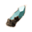

# Tableau des runes

| Image 	| Nom                                                     	| Pds simple 	| Pds Pa 	| Pds Ra 	| Max ligne 	| Pds/stat 	|
|-------	|---------------------------------------------------------	|-----------:	|-------:	|-------:	|----------:	|---------:	|
| | Ini                                                     	|          1 	|      3 	|     10 	|      1010 	|      0.1 	|
| | Vi                                                      	|          1 	|      3 	|     10 	|       505 	|      0.2 	|
| | Fo, Ine, Cha, Age                                       	|          1 	|      3 	|     10 	|       101 	|        1 	|
| | Pui, Pi Per                                             	|          2 	|      6 	|     20 	|        50 	|        2 	|
| | Ré Neutre, Terre, Feu, Eau, Air, Ré Cri, Ré Pou         	|          2 	|      6 	|      - 	|        50 	|        2 	|
| | Pod                                                     	|        2.5 	|    7.5 	|     25 	|       404 	|     0.25 	|
| | Sa                                                      	|          3 	|      9 	|     30 	|        33 	|        3 	|
| | Prospe                                                  	|          3 	|      9 	|      - 	|        33 	|        3 	|
| | Tac, Fui                                                	|          4 	|     12 	|      - 	|        25 	|        4 	|
| | Do Cri, Do Neutre, Terre, Feu, Eau, Eair, Do Pou, Do Pi 	|          5 	|     15 	|      - 	|        20 	|        5 	|
| | Ré Per Neutre, Terre, Feu, Eau, Air                     	|          6 	|      - 	|      - 	|        16 	|        6 	|
| | Ré Pme, Ré Pa, Ret Pme, Ret Pa                          	|          7 	|     21 	|      - 	|        14 	|        7 	|
| | Cri, So, Do Ren                                         	|         10 	|      - 	|      - 	|        10 	|       10 	|
| | Do Per Di, Do Per Mé                                    	|         15 	|      - 	|      - 	|         6 	|       15 	|
| | Do Per So, Do Per Ar                                    	|         15 	|      - 	|      - 	|         6 	|       15 	|
| | Ré Per Di, Ré Per Mé                                    	|         15 	|      - 	|      - 	|         6 	|       15 	|
| | Do                                                      	|         20 	|      - 	|      - 	|         5 	|       20 	|
| | Invo                                                    	|         30 	|      - 	|      - 	|         3 	|       30 	|
| | Po                                                      	|         51 	|      - 	|      - 	|         1 	|       51 	|
| | Ga Pme                                                  	|         90 	|      - 	|      - 	|         1 	|       90 	|
| | Ga Pa                                                   	|        100 	|      - 	|      - 	|         1 	|      100 	|
| | Chasse                                                  	|          5 	|      - 	|      - 	|         1 	|        5 	|
